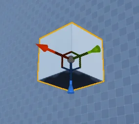
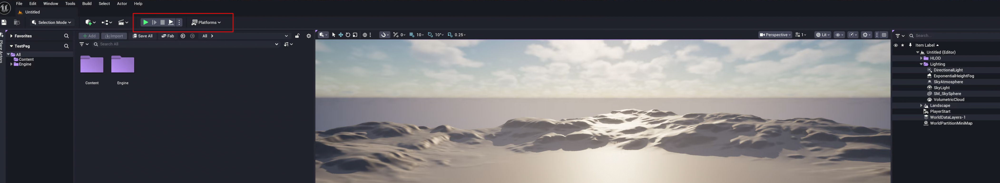
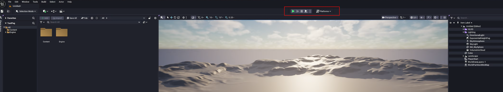

# UE5 Editor Workflow Patches

Small Unreal Engine 5 editor QoL tweaks implemented as source patches.  
These are minimal, targeted changes meant to improve my day-to-day editor usability and serve as practice for me.

> Requires access to Unreal Engine source under the UE EULA.  
> This repo contains **patches only**, not engine code.

---

## Patches included

### 1) Camera-Facing Transform Gizmo
Adds an editor setting that makes the translate/scale widget face the active viewport camera.

- New setting: `Level Editor → Viewport → Look and Feel → Enable Camera Facing Widget`
- Keeps the widget visually oriented toward the camera.
- Corrects drag axis directions to avoid inverted movement when camera-facing is enabled.
- Stores camera→widget direction at drag start for stable interaction while dragging.

I submitted this change as a pull request to Epic Games for inclusion in the engine; it was ultimately not merged, so this repo contains the standalone patch.

**Touches:**
- `Engine/Source/Editor/UnrealEd/Classes/Settings/LevelEditorViewportSettings.h`
- `Engine/Source/Editor/UnrealEd/Private/MouseDeltaTracker.cpp`
- `Engine/Source/Editor/UnrealEd/Private/UnrealWidget.cpp`
- `Engine/Source/Editor/UnrealEd/Private/UnrealWidgetRender.cpp`
- `Engine/Source/Editor/UnrealEd/Public/UnrealWidget.h`

**Demo (GIF):**
<div align="center">
  
  <br/>
  <em>Camera-facing transform widget with axis-correct dragging.</em>
</div>

**Showcase video:**  
- [Detaild showcase and side-by-side comparison](https://www.youtube.com/watch?v=J62xGoh9vuc)

**Optional exploration (not in patch):**
<div align="center">
  
  <br/>
  <em>Axis-aware arrow/axis clarity experiment (separate PoC, not included here).</em>
</div>

---

### 2) Centered PIE / Play Toolbar
Centers the Play-In-Editor (PIE) toolbar section in the Level Editor toolbar layout.

- Adds spacers + width override to center the Play toolbar.
- Keeps Settings toolbar right-aligned.
- Developed for ultrawide / multi-monitor layouts where the default cluster feels off-balance.

**Touches:**
- `Engine/Source/Editor/LevelEditor/Private/LevelEditorToolBar.cpp`

**Before / After:**
<div align="center">
  
  <br/>
  
  <br/>
  <em>Default layout (top) vs centered PIE toolbar (bottom) on an ultrawide layout.</em>
</div>

---

## Applying the patches

Tested on the UE5 `release` branch (5.3.x) - (5.7.0).  
If you’re on a different version, minor conflicts may need manual resolution.

From your Unreal Engine source root:

```bash
git apply <path-to-this-repo>/patches/camera-facing-gizmo.patch
git apply <path-to-this-repo>/patches/centered-pie-toolbar.patch
